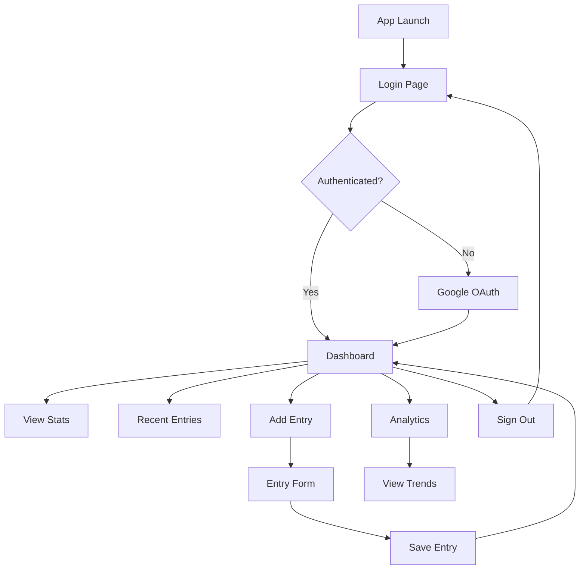

# Sleep Diary App - User Flow Documentation for Figma

## App Overview
The Sleep Diary app helps users track their sleep patterns and improve rest quality through Google authentication and intuitive diary management.

## User Journey Map

### 1. Entry Point & Authentication

#### Landing Page (/)
- **Purpose**: Redirect to login
- **Action**: Automatic redirect to `/auth/login`

#### Login Page (/auth/login)
- **Purpose**: User authentication
- **Components**:
  - App logo (moon icon in gradient circle)
  - Welcome message: "Welcome to Sleep Diary"
  - Subtitle: "Track your sleep patterns and improve your rest quality"
  - Google Sign-In button
  - Terms & Privacy links
- **User Actions**:
  - Click "Continue with Google"
  - Authenticate via Google OAuth
- **Success Path**: Redirect to Dashboard

### 2. Main Application

#### Dashboard (/dashboard)
- **Purpose**: Central hub for sleep tracking
- **Layout**:
  - **Header**: 
    - App logo & name
    - Navigation menu (Dashboard, New Entry, Analytics)
    - Sign Out button
  - **Main Content**:
    - Welcome heading
    - Statistics cards (3 columns):
      - Average Sleep (Last 7 days)
      - Sleep Quality (Average rating)
      - Entries (This month)
    - Recent Entries list
    - "Add New Sleep Entry" CTA button

#### New Entry Page (/dashboard/new-entry)
- **Purpose**: Record new sleep data
- **Form Fields**:
  - Date picker
  - Bedtime selector
  - Wake time selector
  - Sleep quality slider (1-10)
  - Notes textarea (optional)
- **Actions**:
  - Save entry
  - Cancel
- **Success**: Redirect to Dashboard with confirmation

#### Analytics Page (/dashboard/analytics)
- **Purpose**: Visualize sleep patterns
- **Components**:
  - Sleep duration chart (line graph)
  - Sleep quality trend
  - Average bedtime/wake time
  - Weekly/Monthly view toggle
  - Export data option

## Information Architecture

```
Sleep Diary App
├── Authentication Flow
│   ├── Login Page
│   │   ├── Google OAuth Integration
│   │   └── Terms & Privacy Links
│   └── Logout Flow
│
├── Dashboard (Main Hub)
│   ├── Statistics Overview
│   │   ├── Average Sleep Duration
│   │   ├── Sleep Quality Score
│   │   └── Monthly Progress
│   ├── Recent Entries List
│   └── Quick Actions
│
├── Sleep Diary Management
│   ├── New Entry Creation
│   │   ├── Date Selection
│   │   ├── Time Recording
│   │   ├── Quality Rating
│   │   └── Notes
│   ├── Entry Viewing
│   └── Entry Editing
│
└── Analytics & Insights
    ├── Trend Visualization
    ├── Pattern Analysis
    └── Data Export
```

## User Flow Diagram



## Component States

### Button States
- Default
- Hover
- Active/Pressed
- Disabled
- Loading

### Form States
- Empty
- Filled
- Error
- Success
- Validation

### Card States
- Default
- Hover (for interactive cards)
- Selected

## Color Palette
- **Primary**: Stone/Gray tones (from shadcn)
- **Accent**: Blue-Purple gradient (for branding)
- **Background**: Slate-50 to Slate-100 gradient
- **Text**: 
  - Primary: Gray-900
  - Secondary: Gray-600
  - Muted: Gray-400

## Typography
- **Headings**: Bold, larger sizes
- **Body**: Regular weight
- **Captions**: Smaller, muted color

## Responsive Breakpoints
- Mobile: < 640px
- Tablet: 640px - 1024px
- Desktop: > 1024px

## Interaction Patterns

### Navigation
- Top navigation bar (persistent)
- Active state indication
- Smooth transitions

### Data Entry
- Immediate validation
- Clear error messages
- Success confirmations

### Loading States
- Spinner for buttons
- Skeleton screens for content
- Progressive loading

## Accessibility Considerations
- WCAG 2.1 AA compliance
- Keyboard navigation support
- Screen reader compatibility
- High contrast mode support
- Focus indicators

## Future Enhancements (for Figma mockups)
1. **Sleep Goals**: Set and track sleep targets
2. **Reminders**: Bedtime notifications
3. **Insights**: AI-powered sleep recommendations
4. **Social Features**: Share progress with friends
5. **Wearable Integration**: Connect fitness trackers
6. **Export Options**: PDF reports, CSV data
7. **Dark Mode**: Theme switching
8. **Mobile App**: Native iOS/Android designs

## Figma Setup Recommendations

### Page Structure
1. **Cover Page**: App overview and branding
2. **User Flows**: Complete journey maps
3. **Wireframes**: Low-fidelity layouts
4. **High-Fidelity Designs**: Final UI designs
5. **Components**: Design system elements
6. **Prototypes**: Interactive flows

### Component Library
- Buttons (all variants)
- Cards
- Forms and inputs
- Navigation elements
- Icons
- Charts and graphs

### Prototype Interactions
- Link all pages for complete flow
- Add hover states
- Include form interactions
- Demonstrate data visualization

## Design Handoff Notes
- All components use shadcn/ui library
- Tailwind CSS for styling
- Next.js App Router structure
- Prisma for database
- NextAuth for authentication

---

This documentation provides a complete blueprint for creating Figma designs that align perfectly with the implemented application. Use this as a reference when creating mockups, prototypes, and design specifications.